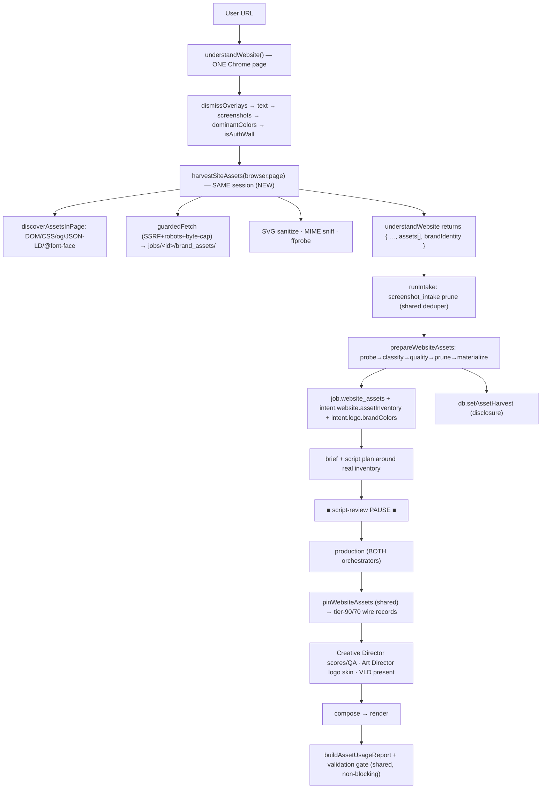

# Website Asset Intelligence Engine — Design & Roadmap

> Turn a website URL into a rich, deduped, quality-scored collection of the site's **own**
> brand assets — logo, icons, hero/product images, screenshots, illustrations, colors, fonts —
> and feed them into the video pipeline so the film looks *custom-made for that brand* instead
> of generic stock.

**Status:** design + roadmap (plan-first, per house rules). No code written yet.
**Method:** researched against the live codebase by a 14-agent workflow (6 readers → 5 design
workstreams → 3 adversarial verifiers). This document is the **reconciled** design — the raw
workstreams disagreed on several load-bearing details; §2 records every conflict and the ruling.

---

## 0. TL;DR — the core insight

**~60% of this spec already ships in Keyframe.** The platform already captures website
screenshots, quantizes brand colors from the hero, prunes junk screenshots, enforces a
user-uploads-first tier law, resolves an accent-only brand skin with source precedence, and
scores/scene-assigns every asset through a Creative Director. Rebuilding those would be a
regression risk, not a feature.

**The genuine new capability is a website asset *harvester*:** the site's own ``/`<svg>`/
CSS-background/`og:image`/`<video>`/`@font-face` bytes are loaded by Chrome during ingest and
then **thrown away** — only pixels-into-a-screenshot and text survive. We add one bounded,
security-hardened, fail-open stage that *keeps* those bytes, classifies + quality-gates them,
and lets them ride the existing tier law, dedup, brand-skin, and Creative Director machinery.

**The highest-lift single line in the whole engine:** `dominantColors(harvestedLogo) →
intent.logo.brandColors`. It reuses the *entire* Art Director precedence → accent-skin →
persistence → brand-coverage disclosure chain with **zero new downstream code**, and instantly
makes every skin-aware pack render in the site's real brand color. Ship that first (M1).

---

## 1. Current state — the reuse surface (what we build *on*, not *beside*)

| Subsystem | File | What it already does | We reuse |
|---|---|---|---|
| Website ingest | `services/ingest/website.js` | One headless-Chrome page: `dismissOverlays` → text scrape → hero+2 section screenshots → `dominantColors` (ffmpeg quantizer) → auth-wall detect | **live browser/page session** (no 2nd nav), `findChrome`, `dismissOverlays(page,{isAuthWall})`, `dominantColors(anyPath)`, the `isAuthWall` guard |
| Screenshot Intelligence | `services/screenshot_intake.js` | Deterministic blank/low-info/near-dup prune of screenshots at intake; disclosure via `db.setScreenshotReview` | `filterScreenshots` prune + its `makeImageDeduper` instance; the fail-open, flag-gated, single-choke-point wiring pattern |
| Asset sourcing | `services/asset_sources/*` | `acquire()`, curated library, providers; `makeImageDeduper` (MD5 + perceptual dHash), `validateImage` (LOW_INFO_STDEV blank gate + dims/alpha/dhash/dominantColor), `ffprobeImage` | the whole **ffmpeg-only probe/dedup stack** — no new native deps |
| Tier law | `services/asset_priority.js` | `tierFor(source)` → 100 upload / 80 website / 60 library / 40 stock; `rankKey = tier*1000+score`; `isOwned`, `isTrustedProminent`, `isLogo` | **the single trust authority** — one edit is honored by CD, VLD, scene_kit, composers everywhere |
| Creative Director | `services/creative_director.js` | Batched 6-dim vision pass scores/scene-assigns every asset; per-scene cap; popup/broken QA demotion (gated `source==='website'`); `isWebStock` never deletes owner content | harvested assets ride the **existing** batched pass — no per-asset LLM added |
| Visual Layout Director | `services/visual_layout_director.js` | Deterministic presentation: `classify`, prominence, hero size, crop focus, device-chrome | extended `classify` routing only |
| Brand skin | `services/art_director.js` | Accent-only skin; precedence **explicit > logo > extracted > inferred** via `intent.logo.brandColors` / `intent.website.brandColors` / `brief.brandColors`; vividness≥0.45 skip-veto override for `provenance:'logo'` | populated, **never bypassed** — harvested logo colors ride `intent.logo.brandColors` |
| User assets | `services/user_assets.js` | `prepareUserAssets` (intake probe+classify), `assetFromUpload` wire shape, `pinUserAssets` (both-orchestrator pin), `inventoryForScript` | mirrored verbatim for `website_assets.js` |
| Persistence | `db.js` | `setScreenshotReview`/`setAssetCoverage`/`setBrandCoverage` array-coerce + `shape()` camelCase mapping | copy-paste template for `setAssetHarvest`/`setAssetUsageReport` |
| Wiring | `services/project_pipeline.js` `runIntake` | The **one shared intake** both orchestrators call (`server.js` always runs `runIntake`); ingest → screenshot prune → language plan → brief → script | the harvest hooks in here, reaching both pipelines from one place |

**Two orchestrators, one intake.** Production runs as either the 12-node LangGraph
(`agents/graph.js`, `orchestrator:"langgraph"` — the configured default) or the legacy linear
twin (`project_pipeline.js runProduction`). Intake is shared. **Rule:** wire discovery + harvest
+ manifest at the shared intake; anything on the production half (pinning, usage report) goes in
a shared helper called from *both* — the exact drift `asset_priority.js` exists to prevent.

---

## 2. Reconciliation decisions (the value-add from adversarial verification)

The five design workstreams were authored independently and **conflicted on the details that
silently break the feature**. All three verify lenses converged here. These rulings are binding
for implementation.

| # | Conflict | Ruling |
|---|---|---|
| **R1** | Source string drifted three ways: `website-asset` / `website_asset` / `website-brand`. `tierFor` does **exact** `===` and fails open to tier 40 (stock). A mismatch silently collapses the whole tier law while the film still renders — invisible to any "did a video come out" test. | **Two canonical constants, each `export`ed once from `asset_priority.js` and referenced by symbol everywhere — never a string literal.** `WEBSITE_BRAND_SOURCE='website-brand'` (tier 90) and `WEBSITE_ASSET_SOURCE='website-asset'` (tier 70). Ship a unit test asserting `tierFor({source:WEBSITE_BRAND_SOURCE})===90` so future drift fails CI. |
| **R2** | Prominence: WS2/WS4 gave **all** approved harvested assets tier-90 + `isTrustedProminent`, letting a decorative mascot out-slot the real product screenshot; the CD verdict couldn't pull it back (legacy path has no VLD to set `__layoutDemoted`). | **Gate tier-90 + trusted-prominent to `website-brand` = the LOGO(s) only** (the one thing we classify with high confidence). **All other harvested assets are `website-asset` tier-70 and reach prominent slots only via the CD's `visionOk`** (the existing `isTrustedProminent` clause already grants prominence to any `visionOk` asset). So a genuine product screenshot is promoted by the CD *that can see it*; a decorative blob is not. Also set `a.__layoutDemoted=true` in the CD when `cdProminence` is `background`/`reject` for `website-asset`, so demotion works on **both** pipelines. |
| **R3** | Licensing: every harvested asset stamped `license:'owner content'`, non-deletable. But the URL is user-supplied and the user often does **not** own the site; pages embed third-party Getty/Unsplash/partner-badge/CDN stock. | **Only `website-brand` (same-origin authored marks) is `owner content` + never-deleted.** `website-asset` carries `license:'site content'` (same-origin) or `license:'third-party (<origin>)'` (cross-origin CDN) and is **CD-deletable** (extend the deletion predicate to include `website-asset`). Never republish a third-party asset as "owner content." |
| **R4** | Fonts: WS3 base64-inlines self-hosted `@font-face` binaries — redistributing a commercial licensed webfont beyond its licensed domain violates most foundry EULAs. | **v1: capture + disclose fonts by name only.** Map the family to a bundled/Google fallback stack. Embedding a self-hosted face is gated behind an explicit opt-in setting and records the source. |
| **R5** | SSRF: WS5 said "use `util.download()`"; WS1 correctly noted `util.download` follows redirects **blindly** — a public URL 302→`169.254.169.254` steals cloud IAM creds. WS1 then **deferred** IP-pinning to v2. | **`guardedFetch` only, never `util.download`, for any discovered URL — and do NOT defer IP-pinning.** Resolve host once, validate every returned address, **pin the validated IP into the connection** (`http.get(url,{lookup})`), re-validate per redirect hop. Also guard the **Chrome navigations** (main `page.goto` + every frontier `goto`) and tighten intake URL validation in `routes/projects.js` (current regex accepts `169.254.169.254.nip.io`, octal/decimal/IPv4-mapped hosts). Use `net.isIP` + BigInt/CIDR checks; add loopback, RFC1918, link-local, ULA, `100.64/10` CGNAT, `64:ff9b::/96` NAT64, IPv4-mapped IPv6, and metadata IPs. |
| **R6** | Untrusted SVG: harvested `<svg>` written to disk and injected inline by the Chrome-based HyperFrames renderer — `<script>`/`onload=`/`<foreignObject>`/`<image href=169.254…>` execute at **render** time, bypassing the fetch guard. | **Sanitize every harvested SVG before persisting** (strip `<script>`, `<foreignObject>`, `on*` attrs, and off-file `href`/`xlink:href`/`url()` refs) **or rasterize to PNG.** Never inject harvested SVG as inline `outerHTML`; embed via `` (disables SVG script) or a sanitized copy. |
| **R7** | Latency: the "20s budget / 5-page crawl" was a **soft** `Date.now()>deadline` checkpoint *between* stages; an in-flight `goto` (+10s) or download wave (+8s) overshoots. Worst case ~100s of work against a 20s ceiling; realistically 0–1 frontier pages complete. The ingest block is **not** wrapped in `withBudget`, so it won't crash — it just grows the user's wait at the script-review pause. | **One `AbortController` fires at the wall-clock deadline into both `page.goto` and `guardedFetch` (hard cap, not a checkpoint).** Size sub-budgets so worst-case sum ≤ budget. **v1 ships homepage-only** (crawl OFF); frontier crawl is a later phase capped at ~2 pages @ ~6s nav. Disclose the true ceiling. |
| **R8** | One dedup locus: WS1 ran dedup *inside* `understandWebsite` against **un-pruned** screenshots; WS2/WS5 ran it at the SI block with a **shared** deduper — physically can't share, so the "never shown twice" guarantee wasn't wired. | **Discovery + download inside `understandWebsite` (reuse the live page); dedup/classify/prune at the SI block.** Make `filterScreenshots({shots, deduper})` accept/return the shared `makeImageDeduper`; seed it screenshots-first so a harvested hero that duplicates a screenshot is the copy dropped. |
| **R9** | Config drift: `config.harvester` defined four incompatible ways (`maxAssets` 40 vs 12 vs 24). Module layout defined 3 ways; classifier taxonomy 3 ways. | **One `config.harvester` schema (§9). One module map (§19). One taxonomy (§7)** with an explicit `kindHint → VLD bucket` mapping. |
| **R10** | Vision cost: appending *all* approved harvested assets to `assets[]` grows the CD's batched pass unboundedly. | **Only `pinWebsiteAssets` survivors (capped 2–4) enter `assets[]` and the CD pass.** Extra approved records stay on `job.website_assets` for disclosure only. |
| **R11** | Default ON shipped a live SSRF surface + ~20–30s + up to 60MB of downloads to every URL ingest before the safety items settle. | **Default OFF (opt-in) for v1** via `WEBSITE_HARVESTER`. Flip on per-environment once R5/R6/R3 are validated. |
| **R12** | `intent.logo = {brandColors}` is a full **replace** (`project_pipeline.js:~173`), clobbering harvested fonts and (when an uploaded logo is monochrome → `[]`) letting harvested colors survive over the upload. | **Merge, not replace:** `intent.logo = {...intent.logo, brandColors: cols}`. Gate the harvested color/font seed strictly on there being **no** `role==='logo'` upload, so a manual logo always wins colors. |

### The reconciled tier ladder

```
100  upload          user MANUAL uploads (pinUserAssets)      owner · trusted-prominent · never deleted
 90  website-brand   the site's own LOGO(s) (brandCritical)   owner · trusted-prominent · never deleted · key-moment
 80  website         full-page screenshots (existing)         owner · trusted-prominent · never deleted
 70  website-asset   other harvested (hero/product/icon/…)    prominent ONLY via CD visionOk · CD-deletable · license by origin
 60  library:* / iconify   curated + recolored SVG (existing)
 40  stock           pixabay / openverse / pexels (existing)
```

`rankKey = tier*1000 + score` ⇒ an upload always beats a harvested logo (100000 > 90000);
a harvested logo beats any screenshot; a plain harvested image (70) beats curated/stock only
once the CD approves it. Uploads stay sovereign; the spec's contradictory orderings collapse to
this one chain.

---

## 3. Architecture overview



Three responsibilities, three modules (§19): **harvest** (`ingest/website_assets.js`),
**integrate/pin** (`services/website_assets.js`), **classify+score** (`asset_classifier.js`,
`asset_quality.js`). Brand extraction lives in the harvester; the report/validation in
`asset_usage_report.js`. Everything is flag-gated + fail-open and never throws out of ingest.

---

## 4. Deliverable 1 — Website Asset Intelligence Agent architecture

`harvestSiteAssets({ browser, page, baseUrl, workDir, isAuthWall, tracker, signal })` — a
4-stage pipeline bounded by **one `AbortController` at a wall-clock deadline** (R7):

1. **DISCOVER** — a single `page.evaluate` DOM walk on the already-loaded, overlay-cleaned page
   (no 2nd navigation) returns candidate descriptors `{url|inlineSvg, discovery, kindHint, w?, h?, ctx}`.
2. **GUARD + FETCH + NORMALIZE** — resolve each URL against `<base href>`, run the **SSRF/robots
   guard** (§13), download via `guardedFetch` (concurrency-pooled) into `jobs/<id>/brand_assets/`
   with size/type/time caps, MIME-sniff, **SVG-sanitize**, `ffprobe`.
3. **CLASSIFY (light)** — stamp `kind` + `hasAlpha`; run `dominantColors()` on the logo pick.
4. **EMIT** — return `{ assets[], brandIdentity, review }`. Deterministic — **no LLM/vision** here;
   relevance/quality scoring is deferred to the CD's existing batched pass once pinned (R10).

Runs inside `understandWebsite`'s existing `try` (before `finally` closes the browser),
gated by `config.harvester.enabled`. Disabled/error ⇒ returns today's contract + `assets:[]`.

---

## 5. Deliverable 2 — Crawling strategy

- **v1: homepage only** (R7). The homepage is already loaded — discovery is free.
- **Frontier (later phase, default OFF):** same `page.evaluate` returns up to 40 nav `<a href>`;
  `pickFrontier` keeps **same-origin** links (exact `URL.origin`, subdomains excluded), dedupes by
  pathname, ranks by `/(feature|product|pricing|about|docs|solution)/i`, **caps at ~2 pages**.
- **Serial, timeboxed, depth-1.** Frontier pages open with `browser.newPage()`, `waitUntil:'domcontentloaded'`,
  `dismissOverlays`, discover, `page.close()`. Never recursed. `isAuthWall` ⇒ skip crawl entirely.
- **Hard cap** via the shared AbortController: a nav in flight when the deadline fires is aborted,
  not awaited. The disclosure reports pages actually crawled (often 1 on slow sites — acceptable).

---

## 6. Deliverable 3 — Asset discovery system (`discoverAssetsInPage`)

One `page.evaluate`, all URLs resolved in-page via `new URL(x, document.baseURI)` (fixes the
"no absolute-URL resolution" gap):

| Source | Extraction | `kindHint` |
|---|---|---|
| `` + **`srcset`** | highest-res srcset candidate; natural `w/h` | logo (alt/class/id/path `/logo|brand|wordmark/i` near top) else hero/product/illustration by size |
| `<picture>/<source srcset>` | best type/media; keep svg + raster fallback | as above |
| inline `<svg>` | `outerHTML` (cap 256KB); skip <16px decorative unless header | icon; logo if header/nav |
| external `*.svg` / `<use href>` / `<object data>` | URL | icon/logo |
| CSS `background-image:url()` | `getComputedStyle` on header/hero/first-2-sections + same-origin `styleSheets` cssRules | hero/illustration |
| `<link rel=icon/apple-touch-icon/mask-icon>` + `/favicon.ico` | href + sizes | favicon |
| web-manifest `icons[]` | fetch+parse in Node stage | favicon/logo |
| `og:image` / `twitter:image` (+`:secure_url`) | meta content — **now downloaded** (closes the core gap) | hero |
| **JSON-LD** `Organization.logo`/`image` | parse `application/ld+json` | logo |
| `<video>`/`<source>`/`poster` | src URLs; poster is an image | video |
| `@font-face src:url()` | same-origin cssRules `CSSFontFaceRule` | font (name-only, R4) |

**Logo identification (new — a logo currently enters only via user upload):** tag `kind:'logo'`
when `discovery ∈ {jsonld-logo, svg-inline(header)}` **or** `alt/class/id/filename` matches
`/logo|wordmark|brand/i` **and** it sits in the header/first viewport. The strongest single mark
(smallest header SVG/PNG-with-alpha; JSON-LD wins ties) is `primaryLogo:true` → `source:'website-brand'`.

---

## 7. Deliverable 4 — Classification system (`asset_classifier.js`)

**One canonical taxonomy** (R9). Pure, deterministic, DOM-aware (`classifyHarvestedAsset(candidate, meta)`):

```
assetType : 'logo'|'icon'|'hero'|'product'|'screenshot'|'illustration'|'marketing'|'team'|'decorative'|'video'
kindHint  : 'vector'|'photo'|'screenshot'   // the ONLY field VLD/scene_kit route on
brandCritical : boolean                      // v1: assetType==='logo' only (high-confidence)
logoVariant?  : { format:'svg'|'png'|'raster', placement:'header'|'footer', theme:'dark'|'light' }
```

`kindHint → VLD bucket` (explicit, single mapping): `logo/icon/illustration → vector`,
`product/hero/marketing/team → photo`, `screenshot → screenshot`. This is what stops a bare logo
or product cutout from being forced into a browser/phone device frame (VLD `classify`, §14).

Decision cascade (first match wins): `video` → `logo` (detectLogo) → `icon` → `team` → `marketing`
→ `screenshot`/`product` (large raster in `main`, UI aspect/token vs packshot) → `hero` → `illustration`
→ `decorative` (hard demote: `min(w,h)<48`, `bytes<2KB`, spacer/tracking cues). `logoVariant.theme`
from `luminance(meta.dominantColor)` picks the right mark per background.

Source assignment: `assetType==='logo'` (same-origin, confident) → **`website-brand`** (tier 90);
everything else → **`website-asset`** (tier 70); cross-origin host → `website-asset` +
`thirdParty:true` (neutral license, CD-deletable — R3).

---

## 8. Deliverable 5 — Quality scoring engine (`asset_quality.js`)

Deterministic, ffmpeg-only, **no per-asset LLM** (`scoreAssetQuality({absPath, assetType, meta, bytes, brandPalette})`):

```
{ qualityScore: 0-100, approved: boolean, brandRelevance: 0-100|null, rejectReason: string|null }
```

- **blank gate** — `validateImage.ok===false` (grayscale `stdev<5`) → hard reject (reuses the exact `LOW_INFO_STDEV`).
- **min-dimension** — `min(w,h)<64` → reject (favicon/spacer/tracking pixel); 64–200 steep penalty.
- **resolution** — `min(1, longEdge/1920)` reward (same curve as `scoreCandidate`).
- **aspect sanity** — extreme ratio penalized *unless* `logo|marketing` (wide marks/banners legit).
- **file weight** — `bytes<2KB` → reject; tiny-file/large-dim mismatch penalized.
- **transparency for logos/icons** — raster `!hasAlpha` where a cut-out is expected → penalty; SVG auto-pass.

`approved = qualityScore ≥ 45 && all hard gates pass`. **Fail-open:** unreadable-but-decodable ⇒
`qualityScore:55, approved:true` (unknown ≠ bad). `brandRelevance` is a deterministic palette-affinity
**seed** (`colorDistance(dominantColor, nearest brand hex)`); the CD's vision pass overwrites it with
`cdScore` — the "batch/piggyback the CD, don't add a call" mandate. `meta` comes from **one**
`validateImage(absPath)` shared across classifier + scorer + deduper (probe once).

---

## 9. Deliverable 6 — Screenshot Intelligence integration

- **Shared deduper (R8):** `filterScreenshots({shots, deduper})` now accepts/returns the shared
  `makeImageDeduper` (backward-compatible default). New `filterHarvestedAssets({candidates, deduper})`
  runs the *same* blank + keep-strongest prune, cross-deduping harvested vs screenshots (screenshots
  seeded first). Distinct review bucket so the two disclosures never collide.
- **Overlay junk never harvested:** `dismissOverlays(page,{isAuthWall})` already strips cookie/chat/
  modal/login overlays *before* the DOM walk. Residual partial-load/spinner/broken thumbnails are
  caught by `asset_quality`'s min-dim/blank/weight gates → dropped at intake, cheaper than a vision call.
- **CD QA gate widened + `__layoutDemoted` (R2):** extend the demotion gate from `source==='website'`
  to also include `website-asset` (guard `!isLogo`), and set `a.__layoutDemoted=true` when
  `cdProminence` is `background`/`reject` so demotion bites on **both** pipelines. Extend
  `system_creative_director.md` so QA fields are *scored* for `website-asset` (else they return
  defaults and never demote — the two edits must ship together).

---

## 10. Deliverable 7 — Brand extraction (logos · colors · fonts)

- **Logos** → `brandIdentity.logos[]` with `role:'primary'|'dark'|'light'|'mark'` variants
  (dark/light from `*-dark`/`*-white` twins + `<source media=(prefers-color-scheme:dark)>`; svg = `mark`).
- **Colors — through the Art Director, never around it.** `dominantColors(primaryLogoPath)` (the
  same quantizer the uploaded-logo path uses) → **merge** into `intent.logo.brandColors` (R12),
  **only when no uploaded logo exists**. The precedence resolver ranks it at the **logo** tier
  (above hero-`extracted`, below an explicit pick) and the `vividness≥0.45` skip-veto override
  applies — **zero Art Director code change.** Hero/CSS colors go to `intent.website.brandColors`.
- **Fonts (R4)** — capture `@font-face` families + computed heading/body `font-family`, **name-only**,
  mapped to a bundled/Google fallback stack on `intent.website.fonts`. Embedding a self-hosted face is
  a gated opt-in follow-up (`brand_font.js` mirrors `caption_fonts.js`, injected at the single
  `injectCaptionStyle` choke so a non-Latin script font still wins).

`brandIdentity = { logos[], palette:{primary,secondary,accent}, fonts:{heading,body}, provenance }`,
serialized into the brief so the script model plans around the real brand system, disclosed via
`db.setBrandIdentity`.

---

## 11. Deliverable 8 — Prioritization rules

**PR-1 tier law** — `tierFor`: `website-brand→90`, `website-asset→70` (§2 ladder). Fail-open unchanged.
**PR-2 trust** — `isOwned`/`isTrustedProminent` add **`website-brand` only**; `website-asset` reaches
prominence solely via the existing `visionOk` clause (R2). Deletion predicate adds `website-asset`
(R3) so off-story harvested imagery the CD rejects is removed; `website-brand` never deleted.
**PR-3 intra-tier order** — pin by `(brandCritical desc, assetPriority desc, qualityScore desc)`.
**PR-4 hard cap** — `pinWebsiteAssets` caps at `maxPins = uploads ? 2 : 4`; harvested do **not** grow
VLD budgets, so they win prominent slots over stock but can't flood the montage (R10).
**PR-5 scene reservation** — pinned scene ids join `pinnedSceneIds`/`screenshotScenes` so stock
backgrounds are suppressed where a brand asset already lives.
**PR-6 dedup-seed order** — seed the `assetSearchAgent` deduper `uploads → website-brand → website-asset
→ screenshots` **before** any stock `acquire()`; a stock photo matching a harvested hero is the copy dropped.
**PR-7 single-logo safety** — promote exactly one harvested logo to `role:'logo'` **only when no
uploaded logo**; else it's a normal tier-90 inset. Prevents two logo chips fighting for the CTA.
**PR-8 fail-open** — missing manifest/swept files/failed probe/empty harvest ⇒ "pin what exists," never throw.

---

## 12. Deliverable 9 — Performance optimization

- **Session reuse** — homepage discovery on the live page; no 2nd nav, no 2nd Chrome.
- **Hard budgets** — total `budgetMs` (recommend **15000**), per-asset `8000`, per-page `6000`,
  robots `3000`, all enforced by the shared AbortController (R7).
- **Concurrency** — download pool `fetchConcurrency:6`; pages serial (memory under `--disable-dev-shm-usage`).
- **Caps** — `maxAssets:24` after dedup; per-type byte caps (image 8MB / SVG 1MB / font 2MB / video 25MB);
  `maxTotalBytes:60MB` running tally aborts further downloads; `Content-Length` pre-skip + mid-stream byte-kill.
- **Rank before download** so caps bite junk first (kindHint weight × size).
- **Image+SVG dedup** — one shared `makeImageDeduper` seeded with screenshot dHashes (R8); SVG by MD5 of *sanitized* markup.
- **Per-domain persistent cache** (later phase) — `harvest_cache/<sha1(origin)>/manifest.json` keyed by
  `sha1(assetUrl)`, 7-day TTL + ETag revalidation, best-effort/fail-open. Skips re-crawl + re-download on repeat jobs.

---

## 13. Deliverable 10 — Security & compliance (hardened)

**SSRF (R5) — the load-bearing control.** The URL is attacker-supplied; this is the top risk.
- `assertPublicUrl(url)`: scheme allowlist `http/https`; `dns.lookup(host,{all:true})` then reject if
  **any** address is loopback/RFC1918/link-local (`169.254/16`, `fe80::/10`)/ULA (`fc00::/7`)/CGNAT
  (`100.64/10`)/NAT64 (`64:ff9b::/96`)/benchmark (`198.18/15`)/`192.0.0.0/24`/`0.0.0.0`/cloud-metadata
  (`169.254.169.254`, `100.100.100.200`, `fd00:ec2::254`). Use `net.isIP` + **BigInt/CIDR** checks that
  normalize IPv4-mapped IPv6 (`::ffff:127.0.0.1`) and numeric/octal/hex encodings (`http://2130706433/`,
  `0177.0.0.1`). Reject `localhost`, `*.internal`, `*.local`.
- **IP-pinning (NOT deferred):** resolve once, validate all addresses, **pin the validated IP into the
  socket** via `http.get(url,{lookup:(h,o,cb)=>cb(null,pinnedIp,fam)})`; re-run per redirect hop (≤3).
  This closes the DNS-rebind TOCTOU (validate-then-connect-to-a-different-IP).
- **Guard the browser too:** run `assertPublicUrl` **before** the initial `understandWebsite` `page.goto`
  and every frontier `goto`; **tighten `routes/projects.js`** URL validation (the current `/^https?:\/\/.+\..+/`
  accepts `nip.io`/octal/IPv4-mapped hosts). Chrome must not render an internal/metadata endpoint.
- **`guardedFetch` only, never `util.download`** for discovered URLs: ≤3 redirects with per-hop
  `assertPublicUrl`, `Content-Type` allowlist (`image/*`, `font/*`, `video/mp4|webm`, `image/svg+xml`),
  byte-cap stream abort, magic-byte MIME sniff on save (an HTML error page saved as `.png` is dropped).

**Untrusted SVG (R6):** sanitize before persist (strip `<script>`/`<foreignObject>`/`on*`/off-file refs)
or rasterize; embed via ``, never inline `outerHTML`.

**Compliance:** `robots.txt` fetched per origin (3s, cached, fail-open-allow) gating frontier **and**
asset URLs; honor `Crawl-delay` or a small per-origin politeness delay. **PUBLIC-only** — no cookies/
auth headers/form submission; `isAuthWall` ⇒ no crawl; no XHR/GraphQL/API probing; only `/favicon.ico`
+ `/robots.txt` path-guessing. **Licensing (R3):** owner-content only for `website-brand`; `website-asset`
neutral license + CD-deletable; fonts name-only (R4). Recommend an ownership/consent affirmation at intake.

---

## 14. Deliverable 11 — Integration points (both orchestrators)

**Exact edit list** (every edit references the single canonical constants from R1):

| Point | File | Change |
|---|---|---|
| IP-1 | `services/asset_priority.js` | `export const WEBSITE_BRAND_SOURCE/WEBSITE_ASSET_SOURCE`; `tierFor` 90/70; `isOwned`+`isTrustedProminent` add `website-brand`; deletion predicate adds `website-asset`. **+ unit test.** |
| IP-2 | `services/ingest/website.js` | call `harvestSiteAssets(browser,page,…)` in the existing `try`; add `assets`/`brandIdentity` to return; update stale JSDoc. Guard `config.harvester.enabled` + `!isAuthWall`. |
| IP-3 | `services/project_pipeline.js` `runIntake` | after the SI block (inside `__ingested` gate): `prepareWebsiteAssets` (thread shared deduper) → `job.website_assets` + `intent.website.assetInventory` + **merge** `intent.logo.brandColors` (only if no upload logo, R12); `db.setAssetHarvest`. Fail-open, flag-gated. **Shared ⇒ both orchestrators.** |
| IP-4 | `services/website_assets.js` (NEW) | `prepareWebsiteAssets` (intake) + `pinWebsiteAssets({job,script,jobDir,usedSceneIds,hasUploadLogo,maxPins})` + `assetFromHarvest` — **one implementation called from both** production halves (mirrors `pinUserAssets`). |
| IP-5 | `agents/graph.js` | `assetPlannerAgent`: `pinWebsiteAssets` after `pinUserAssets`; add `assetPlan.brandAssets`/`brandLogo`; union scene ids into `pinnedSceneIds`. `assetSearchAgent`: seed deduper with brand pins **before** stock; wire concat `[...userPinned, ...brandPinned, ...pinned, ...got]`. |
| IP-6 | `services/project_pipeline.js` `acquireScriptAssets` | mirror `pinWebsiteAssets`; splice `brandPinned` into `pinned` between uploads and screenshots; scene ids → `screenshotScenes`. (Legacy runs no deduper — bounded residual, documented.) |
| IP-7 | `services/creative_director.js` | widen QA-demotion gate to `website`\|`website-asset` (guard `!isLogo`); set `__layoutDemoted` on background/reject; map `brandRelevance=cdScore`. No delete change for `website-brand`. |
| IP-8 | `prompts/system_creative_director.md` | broaden QA-field scope to `website-asset` images (else defaults ⇒ never demote). Ships **with** IP-7. |
| IP-9 | `services/visual_layout_director.js` | `classify`: `website-asset`/`website-brand` route by `kindHint` (`vector`/`photo`/`screenshot`) — bare logos/cutouts not device-framed. |
| IP-10 | `services/scene_kit.js` | `partitionAssets`: `website-*` branch mirroring the upload branch (route by `kindHint`). `role:'logo'` harvested logo rides the existing key-moment path (opening chip + CTA) unchanged. |
| IP-11 | `services/art_director.js` | **no change** — satisfied by IP-3's `intent.logo.brandColors` seed. |
| IP-12 | `db.js` | `setAssetHarvest` + `setAssetUsageReport` + `setBrandIdentity` (array-coerce like `setScreenshotReview`); `shape()` camelCase mappings. |
| IP-13 | `config.js` | `config.harvester` schema (§9), default **OFF** (R11). Deterministic classify/quality — no `stageModels` entry; relevance reuses `creativeDirector.model`. |
| IP-14 | `web/src/screens/ProductionTheater.jsx` | `AssetHarvestPanel` (live, ingest) + `AssetUsageReportPanel` (post-render) beside the existing review panels. |

---

## 15. Deliverable 12 — Production roadmap

Each milestone is **shippable, fail-open, flag-gated**, and adds an acceptance test.

| M | Scope | Why here | Ships |
|---|---|---|---|
| **M1** | Homepage `/<svg>/logo` discovery + `guardedFetch` (full R5 guard) + SVG sanitize (R6) + shared-deduper dedup + minimal logo pick + **`dominantColors→intent.logo.brandColors`** (merge, R12). Tier-90 line + constants + `setAssetHarvest`. | **Highest brand-lift/effort** — reuses the entire Art Director chain for free; every skin-aware pack instantly renders in the site's real color. Smallest surface. | flag OFF by default |
| **M2** | Pin harvested hero/product imagery as tier-70 `website-asset` in **both** orchestrators (real owner visuals, not stock). Cap 2–4. | Real product visuals on screen. | |
| **M3** | Deterministic classification + quality scoring + `filterHarvestedAssets` gating + `kindHint`/`hasAlpha`/`role:'logo'` so VLD frames correctly; CD QA gate widened (IP-7/IP-8 together). | Correct presentation + junk rejection + demotion. | |
| **M4** | Site-palette (`intent.website.brandColors`) + **font capture/disclosure** (name-only, R4). | Fuller brand identity; low risk. | |
| **M5** | Asset Usage Report + validation gate (§16); then **domain cache**; then **frontier crawl** (≤2 pages, hard AbortController, default OFF — lowest lift, highest cost, last). | Reporting + repeat-visit speed; crawl only if measured worth it. | crawl OFF |

**Enablement gate:** do not flip `WEBSITE_HARVESTER` on by default until R5 (SSRF pinning + browser-nav
guard + `routes/projects.js` tightening), R6 (SVG), and R3 (licensing) are implemented and tested.

---

## 16. Validation gate + Asset Usage Report (non-blocking)

Both computed at the **post-composition choke point** (same locus as `persistBrandCoverage`), in
`services/asset_usage_report.js`, persisted via one setter, shown in `ProductionTheater.jsx`. **Never
throws, never gates** — a fully-unbranded prompt-only job legitimately reports all-false and renders.

```jsonc
// buildAssetUsageReport(...) →
{
  "assetsCollected": 14, "assetsApproved": 9,
  "logos": [{ "path","source":"website-brand","role":"logo","usedInScenes":["s3"],"colorsExtracted":["#0FB5A6"] }],
  "screenshots": [{ "path","kept":true,"demoted":false,"sceneId":"s2" }],
  "icons": [...], "illustrations": [...], "videos": [...],
  "brandColorsExtracted": ["#0FB5A6","#122B39"],
  "fontsExtracted": [{ "family":"Inter","source":"@font-face" }],
  "validation": {                        // 7 checks, each { ok, detail } — informational only
    "logoFound","brandColorsFound","screenshotsFound",
    "assetsApproved","assetsTagged","assetsRanked","availableToTemplate"
  },
  "notes": ["cached from prior run","1 product image demoted (popup)"]
}
```

**Law:** no downstream branch may read `report.validation` to alter flow, or it silently becomes a
blocking gate and violates fail-open.

---

## 17. Open product decisions (need your call)

1. **Default state** — recommend **OFF/opt-in** for v1 until the SSRF/SVG/licensing controls are
   validated (R11). Flip on per-environment.
2. **Ownership posture** — recommend neutral license + CD-deletable for cross-origin third-party
   assets, owner-content only for same-origin brand marks (R3), plus an optional intake consent
   affirmation. Alternative: trust the user's ownership claim for the whole domain.
3. **Font embedding** — recommend name-only + fallback stack (R4); embedding self-hosted faces is a
   gated follow-up. Alternative: embed with a licensing disclaimer.
4. **Frontier crawl** — recommend last + OFF (homepage yields most of the brand assets at a fraction
   of the risk/latency). Alternative: enable ≤2-page crawl for pricing/product screenshots.

---

## 18. File manifest

**New:** `services/ingest/website_assets.js` (harvester + `guardedFetch`/`assertPublicUrl`/robots/cache/
SVG-sanitize + brand extraction) · `services/website_assets.js` (intake `prepareWebsiteAssets` + shared
`pinWebsiteAssets`) · `services/asset_classifier.js` · `services/asset_quality.js` ·
`services/asset_usage_report.js` · (later) `services/brand_font.js`.

**Modified:** `services/ingest/website.js` · `services/project_pipeline.js` · `agents/graph.js` ·
`services/asset_priority.js` · `services/screenshot_intake.js` · `services/creative_director.js` ·
`services/visual_layout_director.js` · `services/scene_kit.js` · `prompts/system_creative_director.md` ·
`config.js` · `db.js` · `routes/projects.js` (URL validation, R5) · `web/src/screens/ProductionTheater.jsx`.

## 19. Module map (canonical — resolves R9)

- **`ingest/website_assets.js`** — discovery, crawl, `guardedFetch`, robots, cache, SVG-sanitize, brand extraction. Runs inside `understandWebsite`.
- **`services/website_assets.js`** — `prepareWebsiteAssets` (intake orchestration) + `pinWebsiteAssets` (both production halves) + `assetFromHarvest`.
- **`services/asset_classifier.js` / `asset_quality.js`** — deterministic typing + scoring.
- **`services/asset_usage_report.js`** — report + validation.

## 20. Contracts appendix

```
harvestSiteAssets({browser,page,baseUrl,workDir,isAuthWall,tracker,signal})
  → { assets:HarvestedAsset[], brandIdentity, review } (never throws)
assertPublicUrl(url) → void (throws on non-public; IP-pinned; per-hop)
guardedFetch(url,outPath,{maxBytes,timeoutMs,allowMime}) → {path,mime,bytes}|null
prepareWebsiteAssets({job,jobDir,candidates,brandPalette,tracker,signal}) → {records,review}
pinWebsiteAssets({job,script,jobDir,usedSceneIds,hasUploadLogo,maxPins}) → {brandPinned,brandLogo,usedSceneIds}
classifyHarvestedAsset(candidate,meta) → {assetType,kindHint,brandCritical,logoVariant?}
scoreAssetQuality({absPath,assetType,meta,bytes,brandPalette}) → {qualityScore,approved,brandRelevance,rejectReason}
filterScreenshots({shots,deduper?}) / filterHarvestedAssets({candidates,deduper})
buildAssetUsageReport(...) / validateAssetIntelligence(...) → report / 7×{ok,detail}
asset_priority: WEBSITE_BRAND_SOURCE='website-brand'→90, WEBSITE_ASSET_SOURCE='website-asset'→70
config.harvester = { enabled(WEBSITE_HARVESTER, default false), budgetMs:15000, fetchConcurrency:6,
  maxAssets:24, maxTotalBytes:60MB, minDim:64, approveFloor:45, crawl:false, crawlMaxPages:2,
  cache:false, cacheTtlHours:168, extractFonts:true, embedFonts:false }
db: setAssetHarvest / setAssetUsageReport / setBrandIdentity → shape() camelCase
```

---

*Design produced by adversarial workflow (understand → design → verify). §2 rulings are binding;
they resolve the cross-workstream conflicts that would otherwise silently no-op the tier law.*
